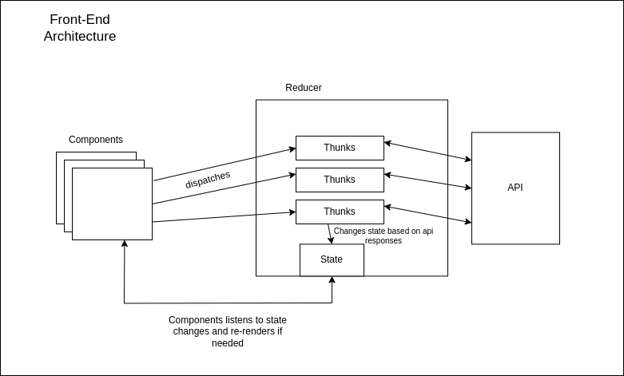
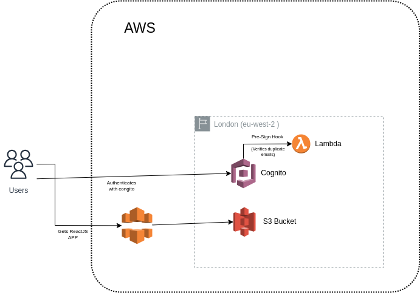

# Login in AWS using Cognito

This project is designed to learn about AWS Cognito and to gain hands-on experience with Terraform and AWS services.

## Overview

This repository is divided into two main parts:

1. **Frontend**: A ReactJS application with Tailwind CSS to implement a user login system.
2. **Infrastructure**: Terraform code to provision the necessary AWS resources for the login system, including AWS Cognito for authentication.

## Frontend

The frontend consists of a ReactJS application styled with Tailwind CSS. It implements a simple login system that integrates with AWS Cognito for user authentication.

For more detailed instructions on setting up and running the frontend, please refer to the [Frontend README](./frontend/README.md).

## Infrastructure

The infrastructure section contains Terraform code to provision AWS resources, including:

- AWS Cognito User Pools and User Pool Clients for authentication.
- Lambda functions, IAM roles, and policies for managing serverless application logic.
- S3 Bucket, to store the static ReactJS client.
- CloudFront, to distribute the ReactJS client across all AWS edge locations.

Here's a graph with the architecture

To learn more about setting up the infrastructure with Terraform, visit the [Infrastructure README](./infrastructure/terraform/README.md).

## How to Use

1. **Frontend Setup**: Follow the instructions in the frontend README to configure the ReactJS application.
2. **Infrastructure Setup**: Use Terraform to set up the necessary AWS resources. Refer to the infrastructure README for detailed steps.

---

